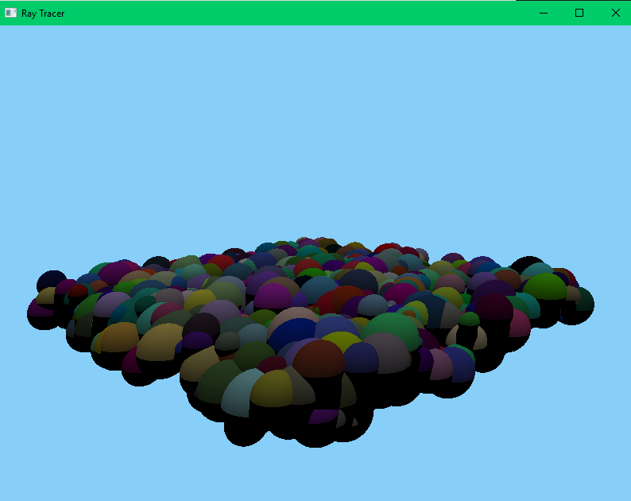

## Ray-Tracer
Basic Ray-Tracer on CPU. It can draw planes, spheres, and boxes.
There are two different light sources: point and directional.
I also make use of BVH algorithm to draw many shapes really fast.

## Libraries

- sfml: <https://www.sfml-dev.org/download/sfml/2.5.1/>
